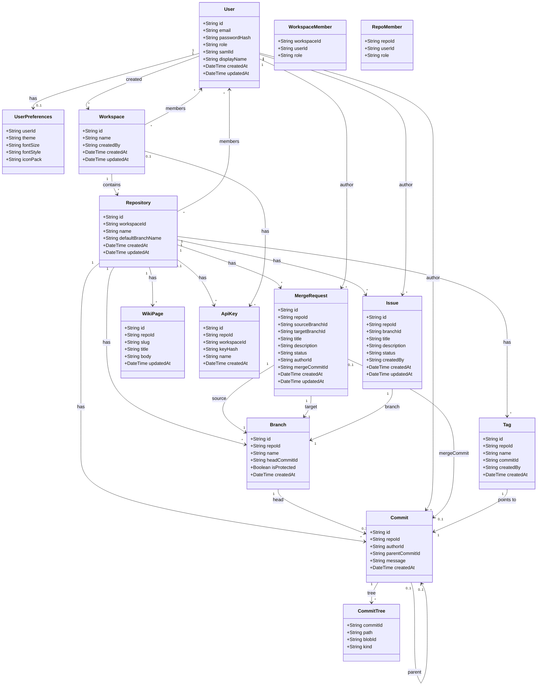
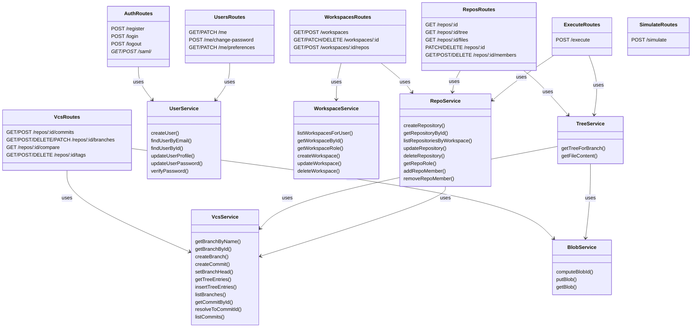
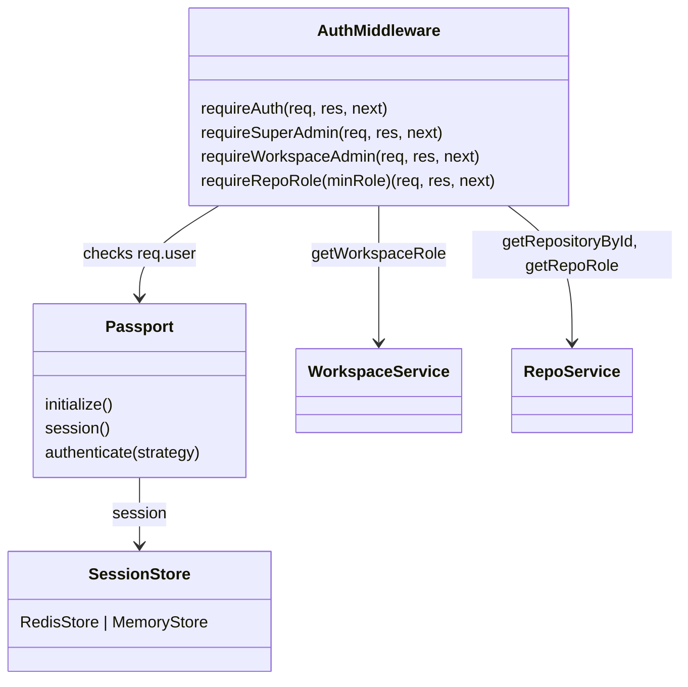
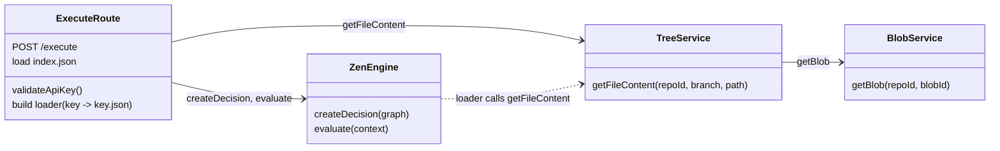

# EngineOne — Class Diagram

Below is a high-level class/module diagram for the main domain and API layer. It focuses on **backend (API)** and **core services**; frontend components are summarized separately.

---

## Domain & data model (Prisma / service layer)



---

## API services and routes (simplified)



---

## Middleware and auth flow



---

## Frontend (high-level components)

```mermaid
classDiagram
  direction TB
  class App {
    Routes
    ProtectedRoute
    ThemeProviderWithPrefs
  }

  class AuthContext {
    user
    loading
    login/logout
  }

  class Layout {
    sidebar
    workspace/repo nav
    outlet
  }

  class Dashboard {
    workspaces list
    repos list
    apiFetch /workspaces, /repos
  }

  class RepoPage {
    tabs: Code, Issues, Branches, PR, Wiki, Settings
    repo meta from /repos/:id
  }

  class CodeTab {
    branch selector
    file tree
    editor (JDM / raw JSON)
    GraphSimulator
    commit dialog
    apiFetch: tree, files, commits, branches
    fetch: /simulate
  }

  class JdmConfigProvider {
    theme
    config
  }

  class DecisionGraph {
    nodes, edges
    JDM schema
  }

  class GraphSimulator {
    onRun(graph, context)
    POST /simulate
  }

  App --> AuthContext : uses
  App --> Layout : wraps protected routes
  Layout --> Dashboard : index
  Layout --> RepoPage : repos/:repoId/*
  RepoPage --> CodeTab : Code tab
  CodeTab --> JdmConfigProvider : wraps
  CodeTab --> DecisionGraph : editor
  CodeTab --> GraphSimulator : panel
  CodeTab --> apiFetch : API
```

---

## Execute flow (ZenEngine)



---

## Diagram index

| Diagram | Description |
|---------|-------------|
| Domain & data model | Prisma entities and relationships (User, Workspace, Repository, Commit, Branch, etc.). |
| API services and routes | Express routers and service modules (auth, users, workspaces, repos, vcs, execute, simulate). |
| Middleware and auth | requireAuth, requireRepoRole, Passport, session store. |
| Frontend | App, AuthContext, Layout, Dashboard, RepoPage, CodeTab, JDM editor, Simulator. |
| Execute flow | Execute route, ZenEngine, TreeService, BlobService. |

To view Mermaid diagrams, use a Markdown viewer that supports Mermaid (e.g. GitHub, GitLab, VS Code with Mermaid extension, or [mermaid.live](https://mermaid.live)).
