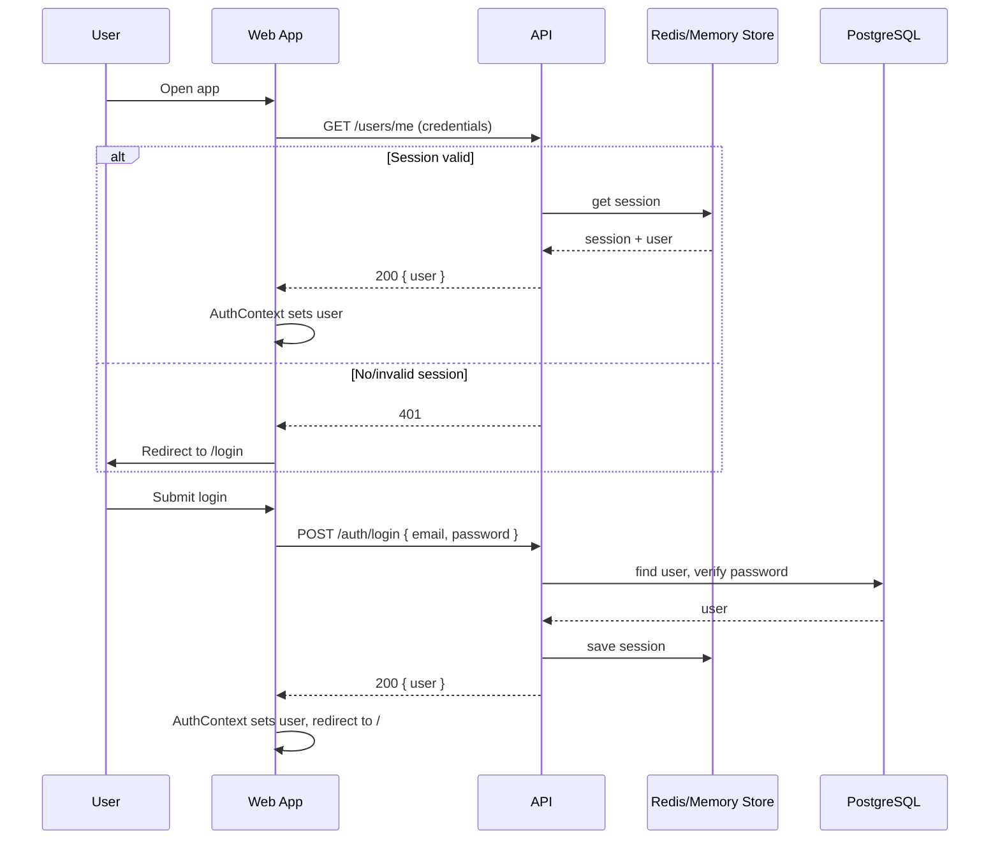
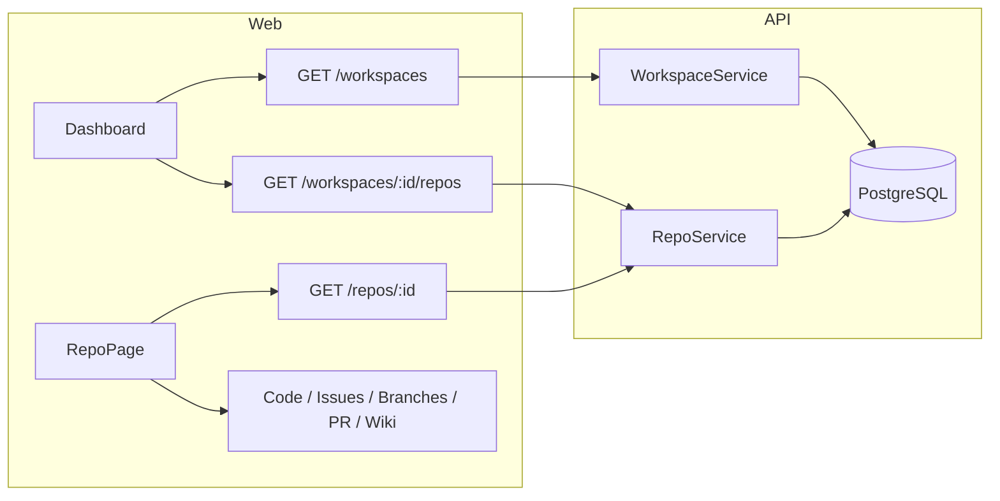
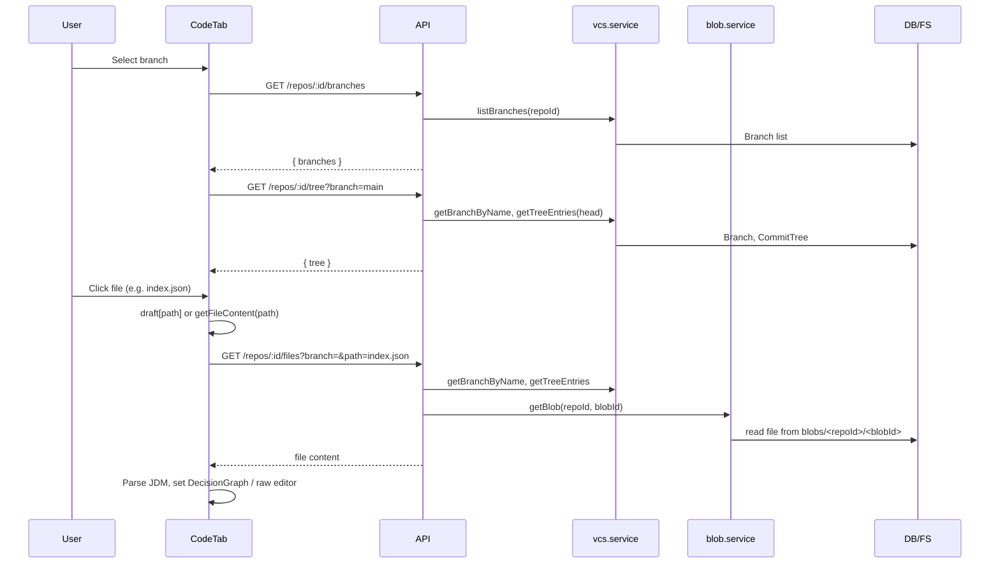
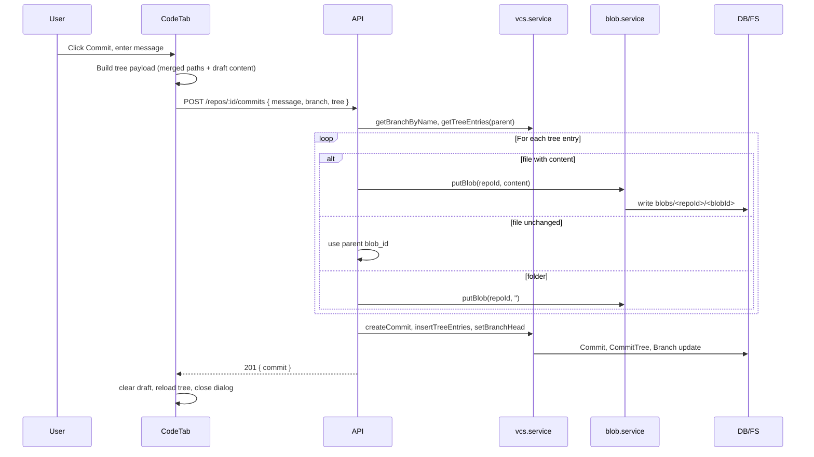
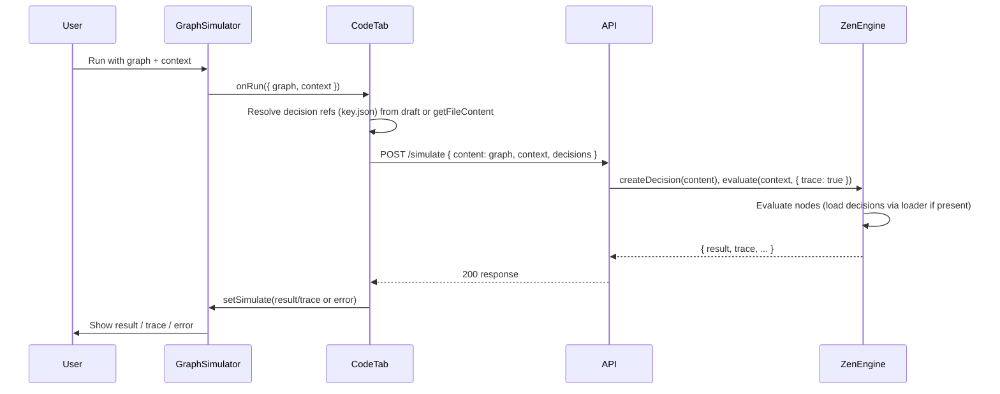
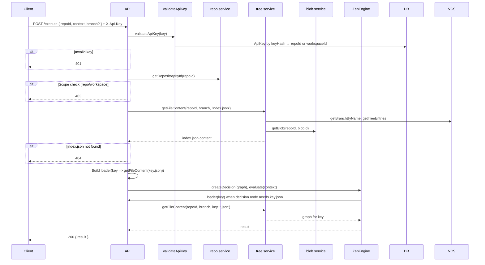
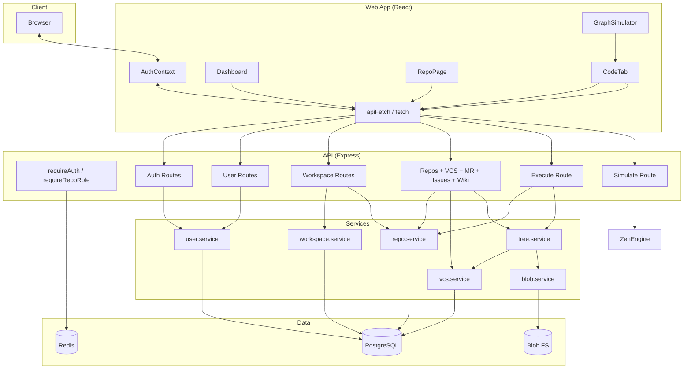

# EngineOne — Data Flow Documentation

This document describes how data moves through the EngineOne system: **authentication**, **workspace/repo navigation**, **code (VCS) and JDM editing**, **simulation**, and **execute**.

---

## 1. Authentication flow

- **Registration:** POST `/auth/register` → create user in DB → `req.login` → session stored (same store as login).
- **Logout:** POST `/auth/logout` → session destroyed.
- **Protected routes:** Frontend uses `ProtectedRoute`; API routes use `requireAuth` (and optionally `requireWorkspaceAdmin`, `requireRepoRole`). Session is read by Passport from cookie.

---

## 2. Workspace and repository navigation

- **Dashboard:** Loads workspaces for user; when a workspace is selected, loads repos for that workspace. Repo click → navigate to `/workspaces/:workspaceId/repos/:repoId`.
- **RepoPage:** Loads repo meta (name, default_branch_name) via GET `/repos/:id`; then per-tab data (e.g. Code tab loads tree and files from VCS endpoints).

---

## 3. Code tab — load and edit flow

- **Draft:** Edits are kept in component state; optionally persisted to **localStorage** (draftStorage) keyed by repoId and branch. No server round-trip until commit.
- **getFileContent:** If path is in `draft`, return draft; else GET `/repos/:id/files?branch=&path=...` → tree → blob → content.

---

## 4. Code tab — commit (save) flow

- **Tree payload:** Each path with kind file/folder; for files, include `content` only when draft has changes (otherwise backend copies from parent tree).
- **Backend:** Same flow as in [VCS-MECHANISM.md](./VCS-MECHANISM.md): new commit, new tree entries, branch HEAD updated; blobs written by blob.service.

---

## 5. Simulate flow (JDM in browser)

- **Decisions:** If the graph has decision nodes with a `key`, CodeTab loads that key’s graph (e.g. `key.json`) from draft or via `getFileContent` and passes them in `decisions` to `/simulate`. The server uses them in ZenEngine’s loader so nested decisions are evaluated.
- **Trace:** Simulation runs with `trace: true` so the UI can show execution trace.

---

## 6. Execute flow (API, production rules)

- **Auth:** Only API key; no session. Key is hashed (SHA-256); stored in `ApiKey` with optional `repoId` or `workspaceId` for scope.
- **Entry point:** Always `index.json` on the given branch. Nested decisions loaded on demand via loader → `getFileContent` → blob store.

---

## 7. End-to-end data flow diagram

---

## Summary table

| Flow | Trigger | Main API | Key services | Data stores |
|------|---------|----------|---------------|-------------|
| Login | User submits credentials | POST /auth/login | Passport, user.service | PostgreSQL, Redis |
| Workspaces/Repos | Dashboard load / nav | GET /workspaces, GET /workspaces/:id/repos | workspace.service, repo.service | PostgreSQL |
| Tree / file read | Branch select, file click | GET /repos/:id/tree, GET /repos/:id/files | vcs.service, tree.service, blob.service | PostgreSQL, FS |
| Commit | User commits in Code tab | POST /repos/:id/commits | vcs.service, blob.service | PostgreSQL, FS |
| Simulate | Run in Simulator | POST /simulate | ZenEngine (in-process) | Request body |
| Execute | External client | POST /execute (API key) | repo.service, tree.service, ZenEngine | PostgreSQL, FS |

For VCS details (commits, branches, blobs), see [VCS-MECHANISM.md](./VCS-MECHANISM.md). For API contracts, see [API-DOCUMENTATION.md](./API-DOCUMENTATION.md).
